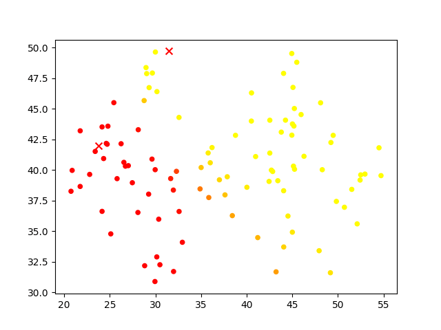
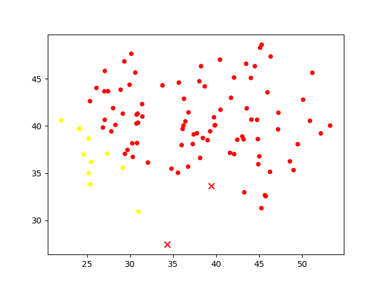

# k-means clustering

K-means clustering for the coursework "Machine Learning Fundamentals"

## Run

1. Artificial data

    * Soft k-means clustering
        ```bash
        python3 k_means.py --data-format points --options soft --num_clusters 2 --num_iterations 5
        ```

    * Hard k-means clustering
        ```bash
        python3 k_means.py --data-format points --options hard --num_clusters 2 --num_iterations 5
        ```

2. Image data

    * Soft k-means clustering
        ```bash
        python3 k_means.py --data-format images --options soft --input-image "Lenna.jpg" --num_clusters 5 --num_iterations 5
        ```
    
    * Hard k-means clustering
        ```bash
        python3 k_means.py --data-format images --options hard --input-image "Lenna.jpg" --num_clusters 5 --num_iterations 5
        ```

## Output

1. Artificial data (Soft k-means clustering, Hard k-means clustering)

    <figure style="text-align: center;">
    
    
    </figure>

2. Image data-Lenna (Soft k-means clustering, Hard k-means clustering)

    <figure style="text-align: center;">
    
    
    </figure>
